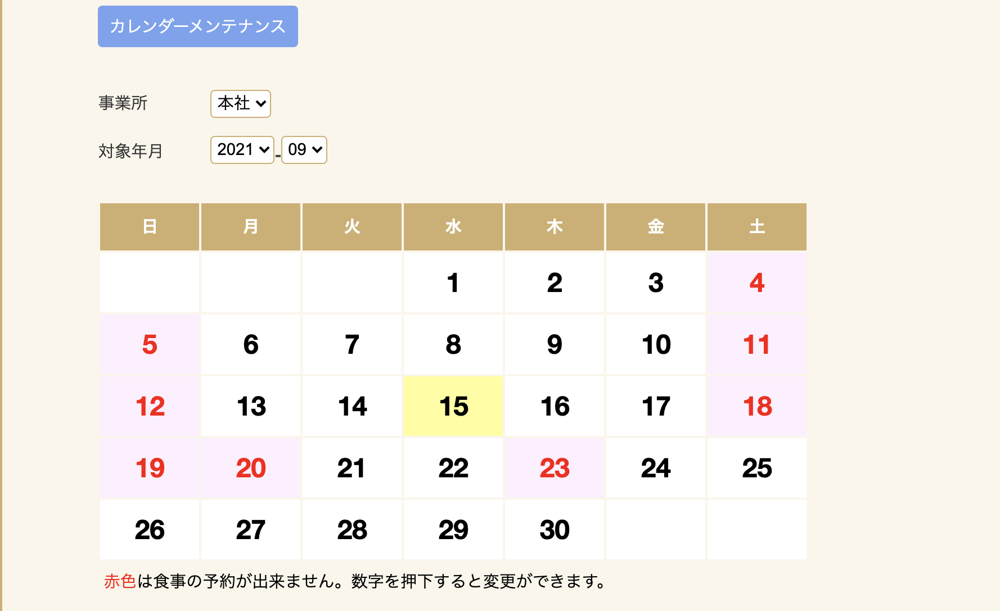
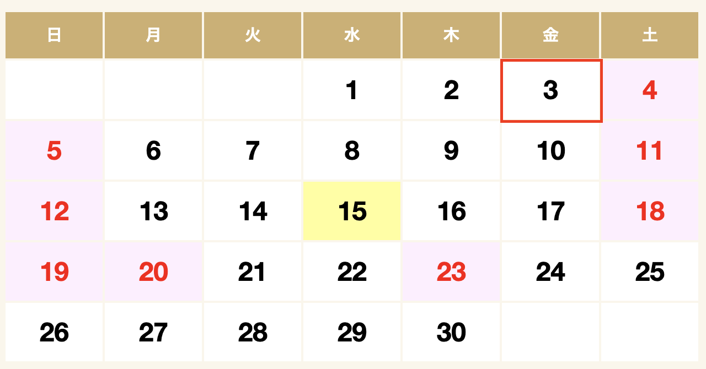
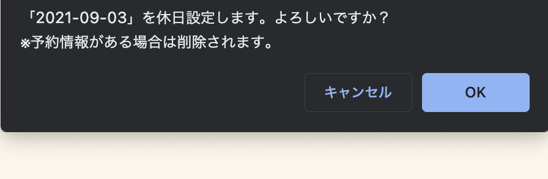
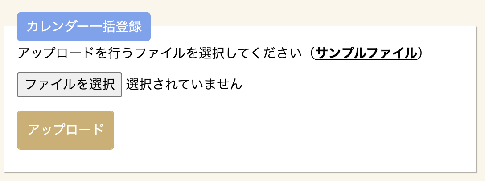

# カレンダーメンテナンス

予約状況照会等で使用されるカレンダーの登録・修正を行うことができます。


## 平日/休日個別設定

平日と休日の変更をしたい日付をクリックしていただくと、平日休日設定の切り替えが行えます。
初期状態では平日/休日は設定されていないため、変更したい日付をクリックするか、CSVから休日を登録します。


クリックすると、設定の確認が表示されるので「OK」を押してください。


## 休日一括設定

まとめて休日を設定する際にはカレンダー一括登録を使用し、CSVファイルを取り込みます。



カレンダーの一括登録ファイルは以下のルールでCSVファイルを作成します。

記載例
```
2020-04-25
2020-04-26
2020-04-29
2020-05-02
2020-05-03
2020-05-04
2020-05-05
2020-05-06
2020-05-09
2020-05-10
...
```

!!! note "記載ルール"
    - 休日設定する日のみ記載してください。
    - 日付形式は`2020-05-02`のように**YYYY-mm-dd**形式で記入してください

「ファイル選択 」ボタンを押して作成したファイルを選択し、  
「アップロード」ボタンクリックすると、ファイルに記載された日が休日となります。
