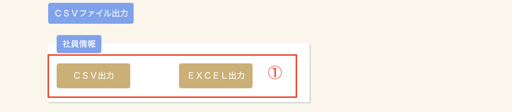
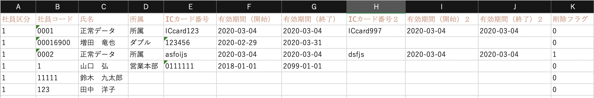
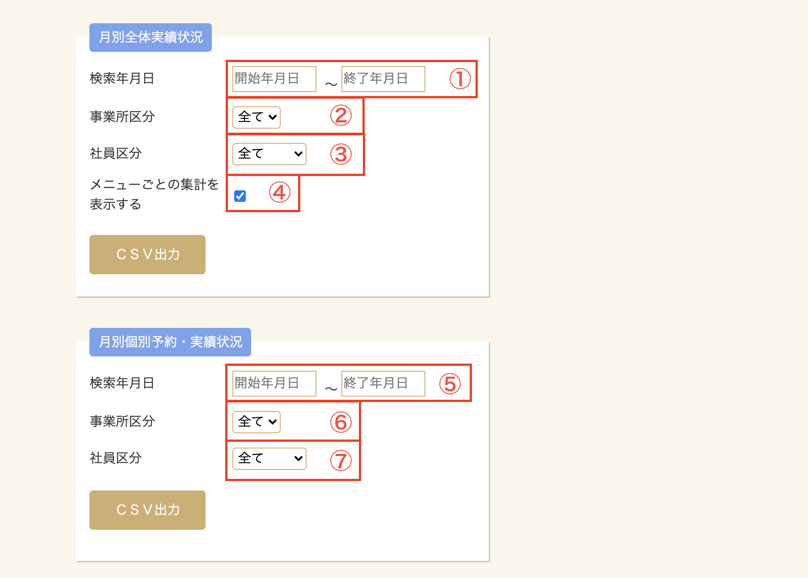
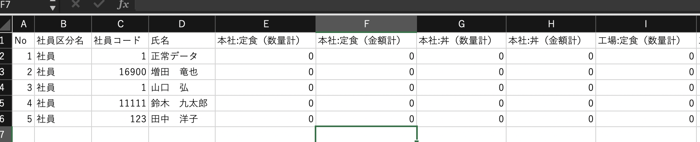
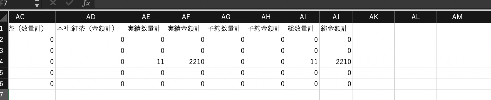
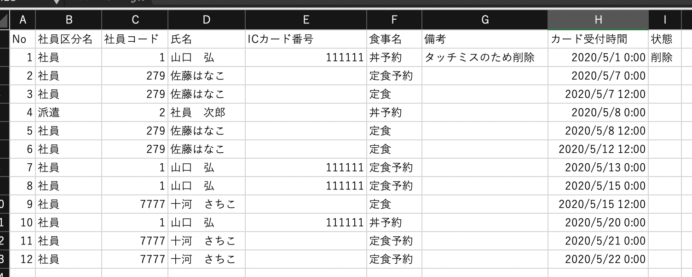

# CSVファイル出力

### 社員情報形式

|No.|説明|
|---|---|
|1|出力形式をCSVかEXCELかを選択します。出力内容は同じです。|

※画面はEXCEL形式のサンプルです。社員情報一括登録時は本ファイルを利用して、登録用ファイルを作成してください。

|項目|入力内容|説明|
|---|---|---|
|社員区分|数字|**※必須項目** 社員区分です。各番号の社員区分については[社員区分マスタメンテナンス](employee_kbn.md)をご確認ください。|
|社員コード|半角文字最大10桁|**※必須項目** 社員コード(社員番号)です。|
|氏名|全半角文字50文字|社員名です。|
|所属|全半角文字50文字|対象社員の所属です。フリーフォーマットのため、追加情報なども入力が可能です。|
|ICカード番号|半角英数字|お使いのMyfair/FelicaカードのIDmです。ICカード番号、ICカード番号2の中ですでに登録されているカードは登録できません。|
|有効期間(開始)|日付|対象カードの使用開始年月日です。空白の場合は開始日は未指定でご利用頂けます。|
|有効期間(終了)|日付|対象カードの使用終了年月日です。空白の場合は無期限でご利用頂けます。|
|ICカード番号2|半角英数字|副カードを登録する場合のMyfair/FelicaカードのIDmです。ICカード番号、ICカード番号2の中ですでに登録されているカードは登録できません。|
|有効期間(開始)2|日付|副カードの使用開始年月日です。空白の場合は開始日は未指定でご利用頂けます。|
|有効期間(終了)2|日付|副カードの使用終了年月日です。空白の場合は無期限でご利用頂けます。|
|削除フラグ|数字|対象社員が削除状態です。 ・0：有効社員 ・1：削除済み|

## 総務部向けCSVファイル出力

|No.|説明|
|---|---|
|1|月別全体実績状況の集計開始年月日と集計終了年月日を指定します。|
|2|月別全体実績状況の出力対象の事業所を指定します。|
|3|月別全体実績状況の出力対象社員区分を指定します。|
|4|メニュー単位での合計数・金額を出力するか選択します。チェックを入れない場合、メニュー単位での集計は出力しません。|
|5|月別個別予約・実績状況の集計開始年月日と集計終了年月日を指定します。|
|6|月別個別予約・実績状況の出力対象事業所を指定します。|
|7|月別個別予約・実績状況の出力対象社員区分を指定します。|

### 月別全体実績状況

月別全体実績状況は、対象月に対して社員別に数量の合計と金額の合計を出力します。
〜

|項目|説明|
|---|---|
|No|1から順に振られます。|
|社員区分名|対象社員の社員区分名です。|
|社員コード|対象社員の社員コードです。|
|氏名|対象社員の社員名です。|
|メニュー数量計|対象社員の対象期間中のメニューの数量の合計です。  登録メニュー数のだけ繰り返し表示されます。|
|メニュー金額計|対象社員の対象期間中のメニューの金額の合計です。 登録メニュー数のだけ繰り返し表示されます。|
|実績数量計|喫食数のみの数量の合計です。|
|実績金額計|喫食数のみの金額の合計です。※予約時に精算する場合は本項目は0になる場合があります。|
|予約数量計|予約数のみの数量の合計です。|
|予約金額計|予約数のみの金額の合計です。※喫食時に精算する場合は本項目は0になる場合があります。|
|総数量計|喫食・予約数を合わせた数量の合計です。|
|総金額計|喫食・予約数を合わせた金額の合計です。|

### 月別個別予約・実績状況

月別全体実績状況は、対象月に対して社員別に予約・喫食の明細を出力します。

|項目|説明|
|---|---|
|No|1から順に振られます。|
|社員区分名|対象社員の社員区分名です。|
|社員コード|対象社員の社員コードです。|
|氏名|対象社員の社員名です。|
|ICカード番号|対象社員のICカード番号です。|
|食事名|喫食・予約のメニュー名です。|
|備考|登録した喫食・予約の備考です。|
|カード受付時間|データが登録された日時です。|
|状態|対象のデータが削除されているかどうかです。 ・空白：有効データ ・削除：削除されたデータ|