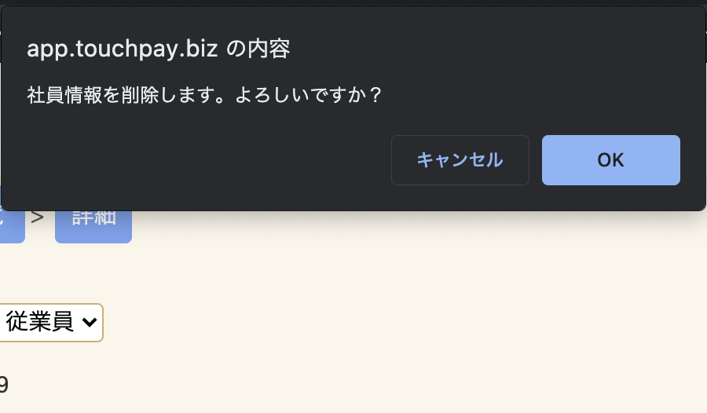

# 社員情報メンテナンス

社員情報の検索・修正・新規登録をする画面です。

## 検索一覧画面

検索条件に該当するデータがある場合、社員コード順（昇順）に表示されます。  
該当データの詳細を閲覧したい場合は、①「詳細」をクリックすると、詳細画面を閲覧することができます。

## 詳細画面

### 該当データの修正

修正したい項目を入力し「修正」ボタンをクリックします。

### パスワードリセット

設定したパスワードが分からなくなってしまったなどの社員からの問い合わせの際に、  
「パスワードリセット」ボタンをクリックすることでパスワードを｢0000｣にリセットします。

### 該当データの削除

該当データの削除を行う場合は、「削除」ボタンをクリックします。クリックすると削除確認メッセージが出ます。

削除確認メッセージの「OK」をクリックすると削除されます。

### 該当データの削除取り消し

削除済みの社員の詳細画面で削除の取消しをクリックし、確認メッセージの「OK」をクリックすると削除が取り消しされます。

## 新規登録

### 個別登録

食堂を利用する社員情報を個別に登録します。
必須項目を入力し、「登録」ボタンをクリックすると登録することができます。  

|項目|入力内容|説明|
|---|---|---|
|社員区分|数字|**※必須項目** 社員区分です。各番号の社員区分については[社員区分マスタメンテナンス](employee_kbn.md)をご確認ください。|
|社員コード|半角文字最大10桁|**※必須項目** 社員コード(社員番号)です。社員コード(社員番号)です。|
|氏名|全半角文字50文字|社員名です。|
|所属|全半角文字50文字|対象社員の所属です。フリーフォーマットのため、追加情報なども入力が可能です。|
|ICカード番号|半角英数字|お使いのMyfair/FelicaカードのIDmです。ICカード番号、ICカード番号2の中ですでに登録されているカードは登録できません。|
|有効期間(開始)|日付|対象カードの使用開始年月日です。空白の場合は開始日は未指定でご利用頂けます。|
|有効期間(終了)|日付|対象カードの使用終了年月日です。空白の場合は無期限でご利用頂けます。|
|ICカード番号2|半角英数字|副カードを登録する場合のMyfair/FelicaカードのIDmです。ICカード番号、ICカード番号2の中ですでに登録されているカードは登録できません。|
|有効期間(開始)2|日付|副カードの使用開始年月日です。空白の場合は開始日は未指定でご利用頂けます。|
|有効期間(終了)2|日付|副カードの使用終了年月日です。空白の場合は無期限でご利用頂けます。|
|社員食堂使用不可|チェック|チェックを入れると社員食堂の利用が不可能となります|
|備考|全半角文字40文字|社員情報につい備考を記載します。|

### 一括登録

複数の社員情報をまとめて登録する場合、CSVまたはExcelファイルをアップロードして登録することができます。作成するファイルは[CSVファイル出力の社員情報形式](csv.md#_1)を参考に作成してください。  

!!! warning "一括登録時の注意事項"
    - ファイルに内に記載されている社員番号がすでに本システムに登録されている場合、**システムに登録済みの情報を取込ファイルの内容で上書きします。**  
    - ファイルに内に記載されている社員番号が本システムに登録されていない場合、**新規に社員を登録します。**

#### アップロードの方法

1. アップロード形式を「CSV」か「EXCEL」から選択します
2. ファイル選択で作成したファイルを選択します。
3. 「アップロード」ボタンをクリックするとアップロードが開始されます。
4. アップロードが完了すると「ファイルのアップロードに成功しました」と表示されます。記載不備などで取込ができなかった場合はエラーが表示されます。

