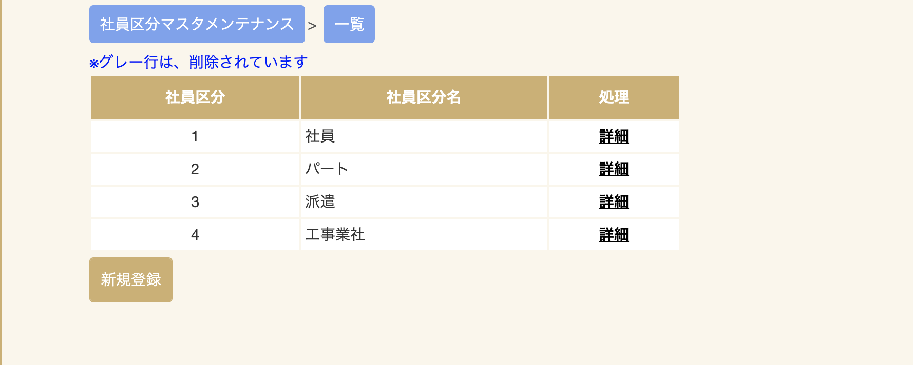
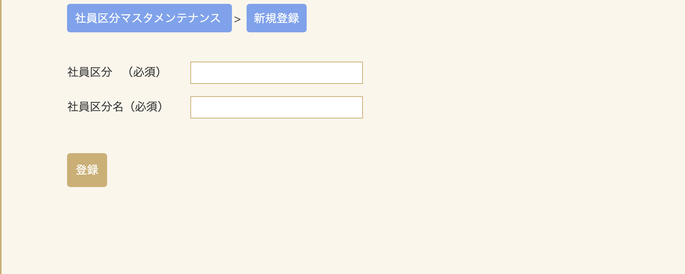
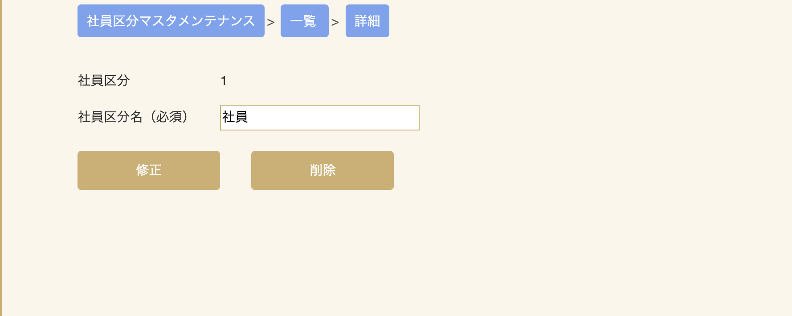

# 社員区分マスタメンテナンス

社員登録に利用する社員区分の新規登録、修正、削除を行う事が出来ます。

## 新規登録画面

社員登録に利用する社員区分の新規登録を行ないます。一覧画面の「新規登録」ボタンをクリックし、新規登録画面に進みます。

|項目|入力内容|説明|
|---|---|---|
|社員区分|数字(最大2桁)|**※必須項目** 社員区分を入力してください。|
|社員区分名|全半50文字|**※必須項目** 社員区分名を入力してください。|

社員区分と社員区分名を入力して、登録をクリックすると新規社員区分の登録が完了します。
入力した社員区分がすでに登録してある場合、エラーとなります。

## 修正/削除画面

社員区分の修正、削除を行うことができます。
一覧画面の「詳細」をクリックすると、社員区分修正/削除画面が開きます。

社員区分名を変更する場合は新しい社員区分名を入力した後、「修正」をクリックしてください。
他仕様の社員区分を削除する場合は「削除」をクリックしてください。  
**※修正できる項目は社員区分名のみとなります。社員区分は変更できません。**

