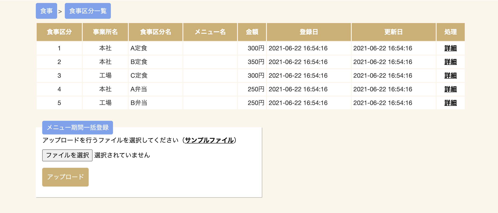
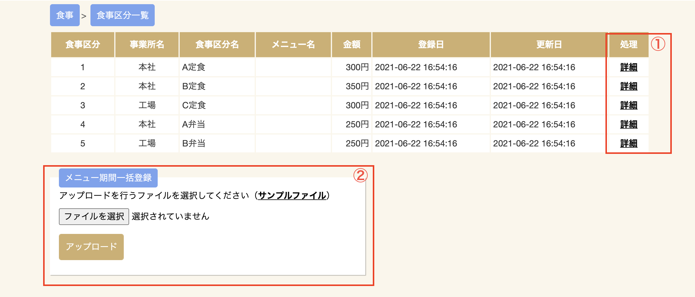
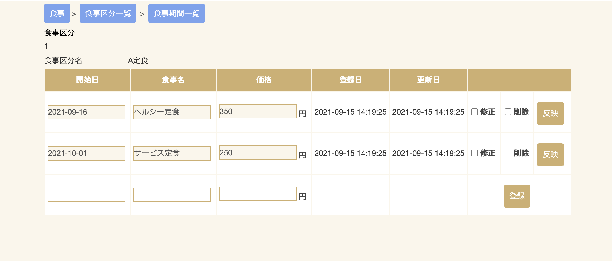
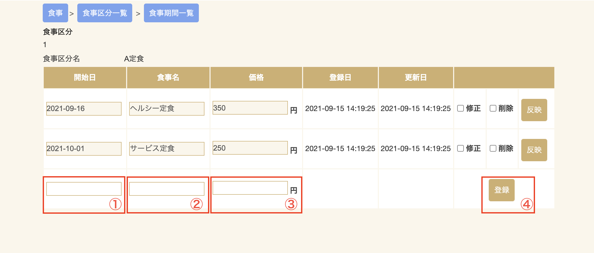
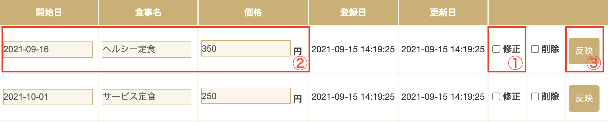
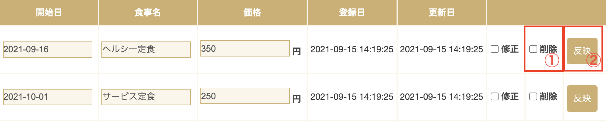
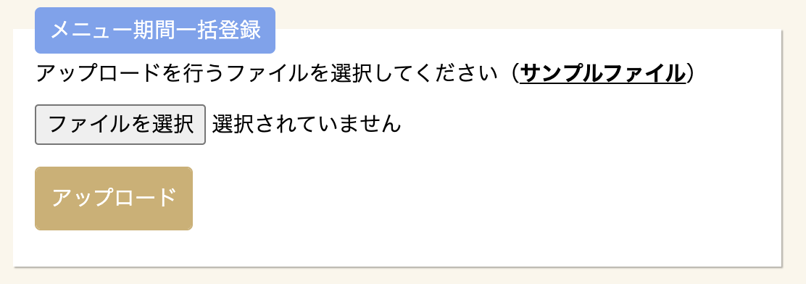
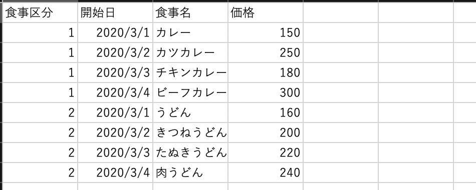

# 食事メンテナンス

各メニューの一時的なメニュー名、価格の登録・修正を行うことができます。  

食事区分一覧から変更したいメニューの詳細をクリックしていただくと、メニュー情報の変更が行えます。
また、CSVファイルを作成することにより一括で登録することもできます。

| No. | 項目名 | 説明 |
| --- | --- | --- |
| 1   | 食事区分 | メニューに対して設定された食事区分を表示します。|
| 2   | 事業所名 | メニューに対して設定された事業所名を表示します。|
| 3   | 食事区分名 | 食事に対する区分を表示します。帳票で表示する食事名です。|
| 4   | メニュー名 | メニュー名を表示します。食事区分の備考としてお使い頂けます。|
| 5   | 金額 | 現在の期間に設定されている価格を表示します。 |
| 6   | 登録日 | メニュー登録日を表示します |
| 7   | 更新日 | 更新日を表示します |

1. 詳細リンクをクリックすることで食事期間一覧の画面を移動します。
2. まとめて食事期間を設定する際にはメニュー期間一括登録を使用し、CSVファイルを取り込みます。

## 食事期間一覧

食事区分一覧より詳細をクリックすると食事期間一覧画面が表示されます。  
ここでは各メニューに食事区分とは別の開始日、食事名、価格を設定できます。

食事区分に対しメニュー開始日を設定する事で開始日になると自動で価格を変更する事ができます。  
日替わり定食などの毎日値段が変更される場合にご利用ください。

!!! note "開始日について"
    設定した価格を開始する日を設定します。  
    終了日は次のメニューの開始日までとなり、次の開始日が設定されていない場合は無期限で開始日が最新のメニューの価格が設定されます。

### 価格登録

1. 選択した日付より食事名、価格が適用されます。
2. 開始日より適用させたい食事名を入力します。
3. 開始日より適用させたい価格を入力します。
4. 1〜3を入力後、クリックするとデータが登録されます。

### 価格修正

誤って登録してしまった場合、修正を行うことができます。

①にチェックを入れると②が入力可能になります。新しい情報を入力して③をクリックすると変更が反映されます

### 価格削除

食事期間登録を削除することができます
削除したい行の①にチェックを入れ、②をクリックすると反映されます。
削除された行は開始日が来ても適用されません。
削除された行を再び適用するには修正し、反映する必要があります。

## 食事期間一括登録

食事期間の一括登録は食事区分、開始日、食事名、価格を記入したCSVファイルを作成し、アップロードします。
アップロードするファイルを選択し、アップロードボタンをクリックすると
CSVに記載したデータが一括で登録されます。

### フォーマット

|No.|項目名|説明|
|---|---|---|
|1 |食事区分| 登録する食事区分を指定します|
|2 |開始日| 価格を開始する日を設定します |
|3 |食事名| 食事名を設定します。食事区分名に対し、メニュー名となります |
|4 |価格| 開始日に対する価格を設定します。 |
