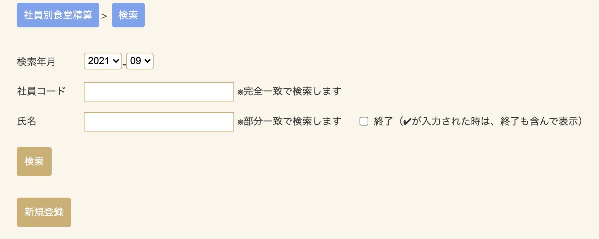
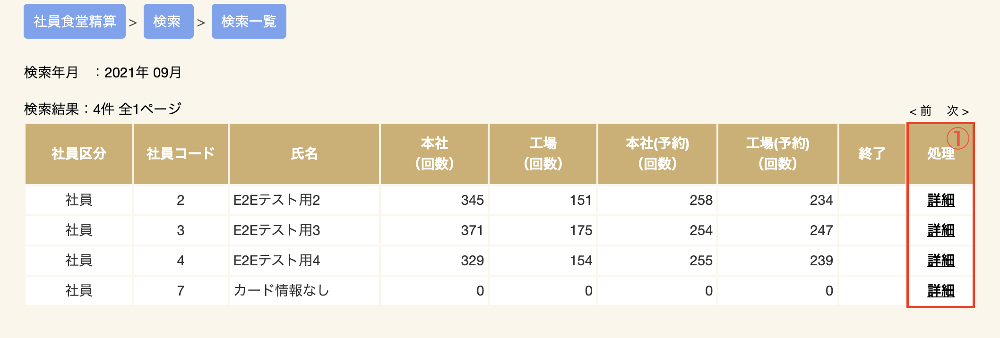
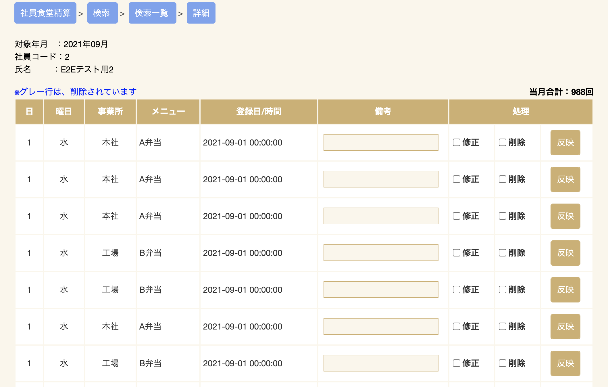
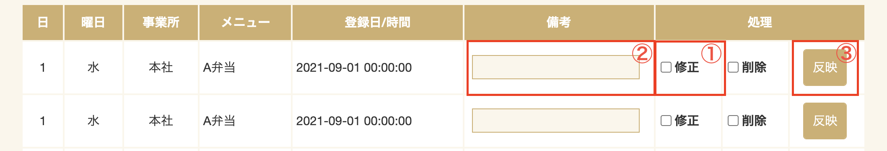
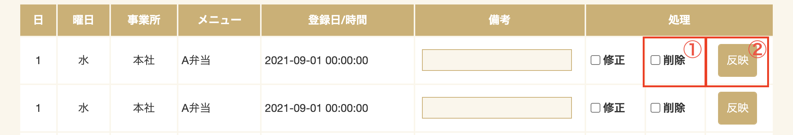
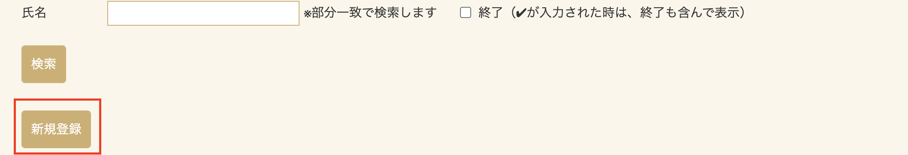
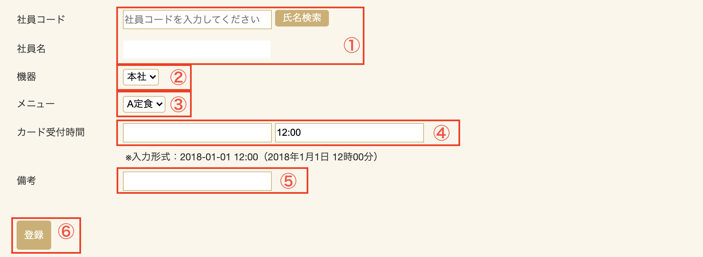

# 社員別食堂精算

## 検索画面

検索する年月を選択します。
対象の社員コード、または氏名を入力し、検索ボタンをクリックします。

## 検索一覧画面

検索条件に該当するデータがある場合、社員コード順（昇順）に表示されます。
該当データの詳細の閲覧や、削除する場合は、①「詳細」をクリックして詳細画面上で行います。

## 喫食詳細画面

対象社員の喫食一覧が表示されます。また、備考の登録と削除が可能です。

### 喫食備考登録

喫食に対し備考を追加出来ます。

1. 「修正」チェックを入れると「備考」欄と「反映」ボタンが有効になります。
2. 備考欄に任意の文字を入力します。
3. 「反映」ボタンをクリックすると備考が反映されます。

### 喫食削除

喫食の削除が出来ます。

1. 「削除」チェックを入れると「反映」ボタンが有効になります。
2. 「反映」ボタンをクリックすると削除が反映されます。
 
 
## 新規登録画面
ピットタッチプロにタッチせずに食事の実績データを登録することができます。
社員別食堂精算の検索画面から新規登録ボタンをクリックします。

### 喫食新規登録

1. 食事を予約したい社員の｢社員コード｣を入力します。  該当する社員が存在した場合、「社員名」の部分に名前が表示されます。
2. で機器（ピットタッチプロの設置事業所）を選択します。
3. でメニューを選択します。
4. にカード受付時間を入力します。(選択するとカレンダーが出てきます。)
5. メモを備考に入力できます。
6. 入力されている情報に間違いがない事を確認し、
登録ボタンをクリックします。

(例：5月24日に定食を喫食)

 
登録が正常に行われると｢登録を行いました。｣と表示されます。
 
 
5月24日に実績追加されます。
