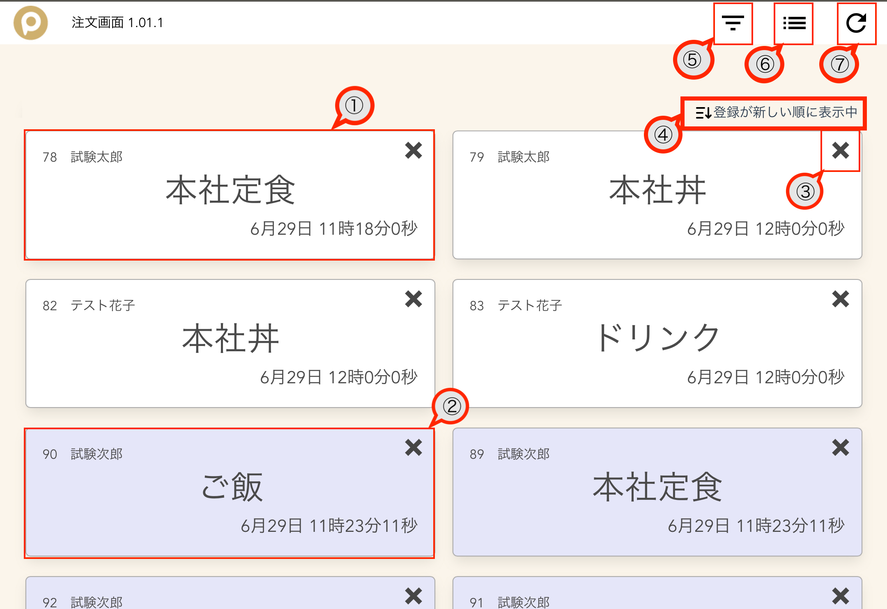
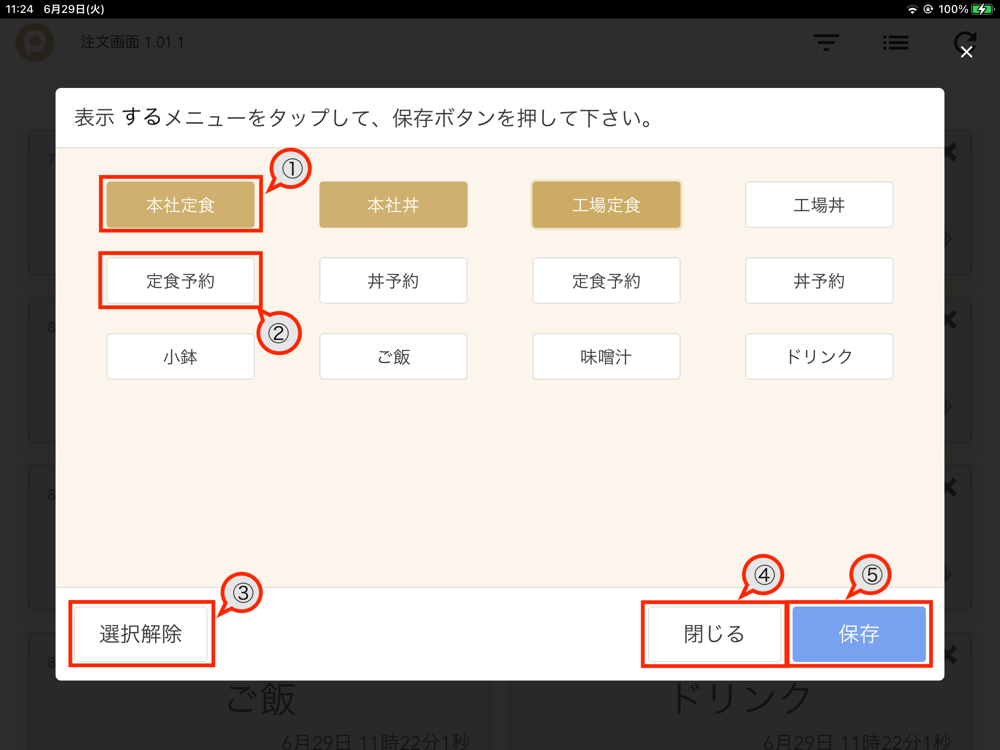
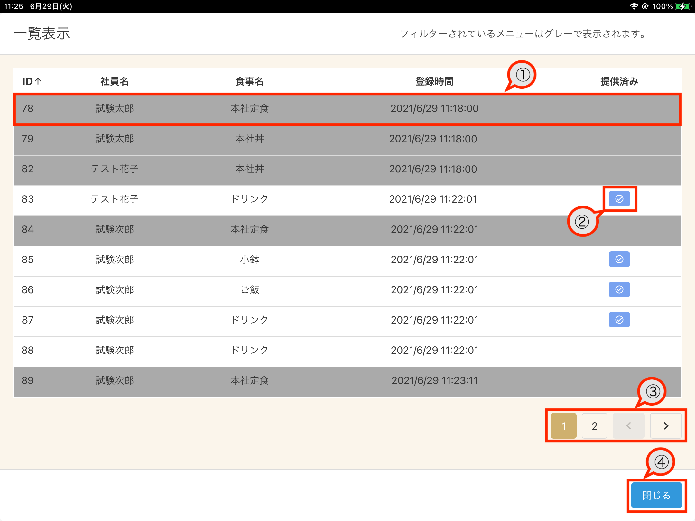

# 厨房向け注文表示機能

タブレットを使用し、当日の喫食データをリアルタイムに表示することができます。

## 起動方法

1. タブレットを起動し、ホーム画面のアイコンをタップします。

## 画面説明

### 注文表示画面

リアルタイムで注文されたメニューのデータを表示します。  
提供が終了した時に提供ボタン（✖️ ボタン）をタップすることでメニューを閉じることができます。

| No  | 項目                 | 説明                                                                                                           |
| --- | -------------------- | -------------------------------------------------------------------------------------------------------------- |
| 1   | メニュー表示         | 当日に PitTouch やタブレットで注文したデータが表示されます。 数が多くなるとスクロールすることができます。   |
| 2   | メニュー表示（新規） | 直近 30 秒以内に追加されたメニュー表示は青く表示されます。 30 秒経過すると自動的に白くなります。            |
| 3   | 提供ボタン           | メニューを閉じることができます。                                                                               |
| 4   | 並び順表示           | 現状の並び順が表示されています。 タップすることで並び順を「新しい順」、「古い順」で切り替えることができます |
| 5   | フィルターボタン     | フィルター画面を表示します。                                                                                   |
| 6   | 注文一覧表示ボタン   | 注文一覧表示画面を表示します。                                                                                 |
| 7   | リロードボタン       | 画面のリロードを行います。 画面のデータが古かったり異常が見られた場合にご利用ください。                     |

### メニューフィルター画面

表示したいメニューを選択して絞り込むことができます。

| No  | 項目                       | 説明                                                                                             |
| --- | -------------------------- | ------------------------------------------------------------------------------------------------ |
| 1   | メニューボタン（選択済み） | 表示したいメニューを選択することができます。                                                     |
| 2   | メニューボタン（未選択）   | 選択していないメニューは白く表示されます。 タップすることで選択できます。                     |
| 3   | 選択解除ボタン             | 全ての選択を解除します。                                                                         |
| 4   | 閉じるボタン               | 保存せずにモーダルを閉じます。                                                                   |
| 5   | 保存ボタン                 | フィルター情報を保存します。 選択されたメニューのみが注文表示画面で表示されるようになります。 |

### 注文一覧表示画面

| No  | 項目           | 説明                                                                                                   |
| --- | -------------- | ------------------------------------------------------------------------------------------------------ |
| 1   | 注文データ     | 当日の注文データが表示されます。 フィルターに選択されているメニューはグレーアウトして表示されます。 |
| 2   | 提供済み表示   | 提供済みのメニューはチェックがつきます。                                                               |
| 3   | ページ切り替え | 10 データ単位でページが表示されます。                                                                  |
| 4   | 閉じるボタン   | 注文一覧表示画面を閉じます。                                                                           |

## 使用方法

1. アプリを起動し、厨房内（あるいは厨房側から見れる場所）に配置します。
1. フィルター画面で表示したいメニューを選択し保存します。（フィルターの必要がない場合は不要な手順です。）
1. PitTouch やタブレットからデータが登録されると、自動的に画面にメニューが追加されます。

当システムはネットワークが不通の場合正常に動作しません。 必ずネットワークが正常であることを確認した上でご利用いただくようお願いいたします。

## エラーメッセージ

| No  | エラーメッセージ                                                 | 説明                                                                                                                                                                                                               |
| --- | ---------------------------------------------------------------- | ------------------------------------------------------------------------------------------------------------------------------------------------------------------------------------------------------------------ |
| 1   | バージョンの取得に失敗しました。ネットワークを確認してください。 | ネットワークに不備がありアプリケーションのバージョンが正常に取得できなかった、またはバージョンアップが行われなかった可能性があります。 ネットワークが正常であること確認し、リロードボタンをタップしてください。 |
| 2   | データの取得に失敗しました。ネットワークを確認してください。     | ネットワークに不備がありデータが正常に取得できなかった可能性があります。 ネットワークが正常であること確認し、リロードボタンをタップしてください。                                                               |
| 3   | サーバーでエラーが発生しました。管理者様にお問い合わせください。 | サーバーに不具合がある可能性があります。 万が一発生した場合は、管理者様より弊社にお問い合わせいただくようお願いいたします。                                                                                     |
| 4   | メニューの取得に失敗しました。ネットワークを確認してください。   | ネットワークに不備がありデータが正常に取得できなかった可能性があります。 ネットワークが正常であること確認し、リロードボタンをタップしてください。                                                               |
