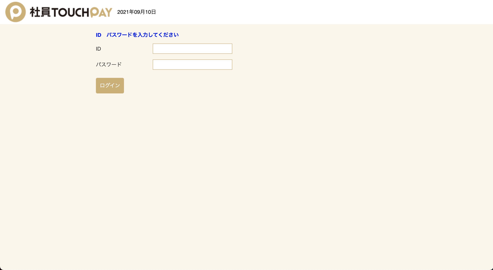
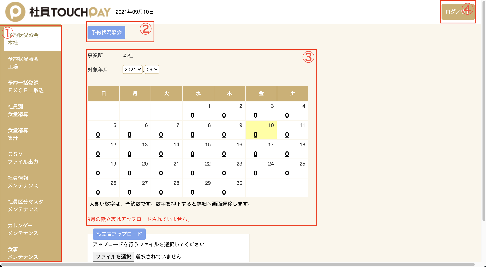
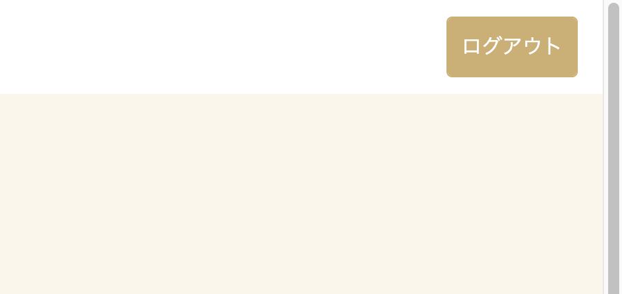

# システムのログイン

## ログイン方法

管理者のログインID、パスワードを入力し、ログインボタンをクリックし、システムにログインします。

!!! note "ログイン情報について  "
    管理画面へのログインURLは別途ご連絡いたします。

## メイン画面

ログイン後の画面です。

| No. | 説明|
| --- | --- |
| 1   | サイドメニューです。|
| 2   | サイドメニューで選択した機能の階層を表示します。クリックで対象の機能にジャンプします。|
| 3   | メインの機能を表示する場所です。|
| 4   | ログアウトボタンになります。|

!!! warning "ご利用時の注意"
    前の画面に戻る場合、画面遷移時にブラウザの「戻る」ボタンは使用せず、システム上のメニューをクリックしてジャンプしてください。戻るボタンを押した場合、検索結果が正常に表示されない可能性があります。

## ログアウト方法

システムからログアウトをしたい場合は、右上の「ログアウト」ボタンよりログアウトすることができます。

