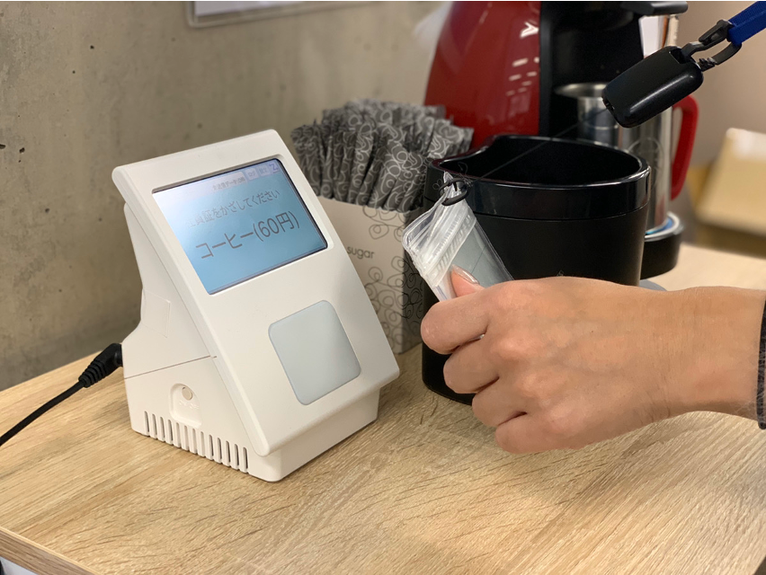
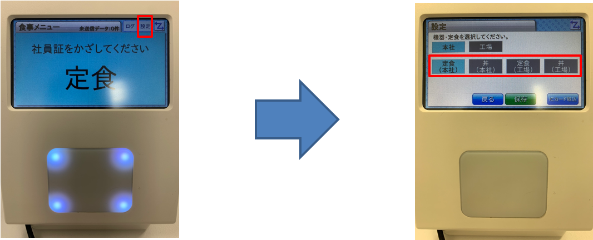
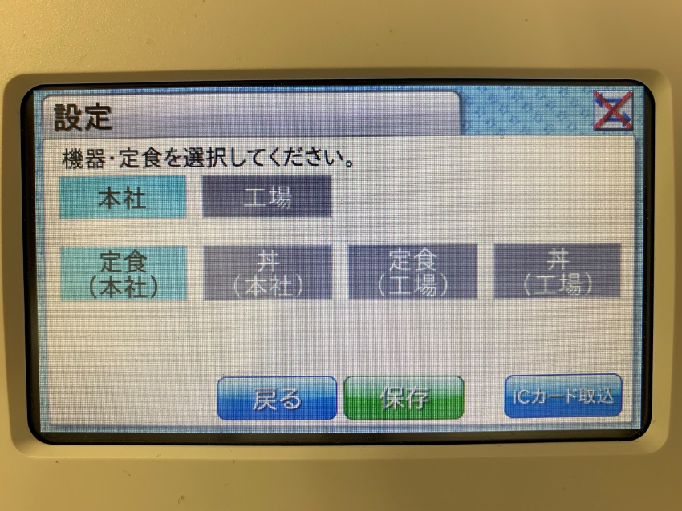

# 喫食端末の使用方法

## 使用イメージ

以下のようにICカード読取り部にカードをタッチします。

## メニュー変更/設定

表示メニューを変更する場合は以下の手順にて設定します。

1. タッチ待機画面の「設定」ボタンを押すとメニュー設定画面を表示します。
2. 表示したいメニューボタンを押して、「保存」ボタンを押してください。

## 社員情報の更新について

ピットタッチプロ２は毎日23:40に、自動で社員情報を端末にダウンロードします。  
そのため、端末にダウンロードするまでは変更した社員情報は端末に存在しません。  
  
即時社員情報を登録したい場合は、メニュー変更画面の右下の「ICカード取込」ボタンを押してください。
社員情報のダウンロードが行えます。

!!! warning "ご利用上の注意点"
    自動ダウンロードの際に、ピットタッチプロ本体の電源がOFFの状態だと情報が更新されないため、出来るだけ端末の電源はONにしてください。  
    もし、電源をOFFにした場合は電源ON時に必ず上記のICカード取込ボタンよりカード情報取込を行ってください。
