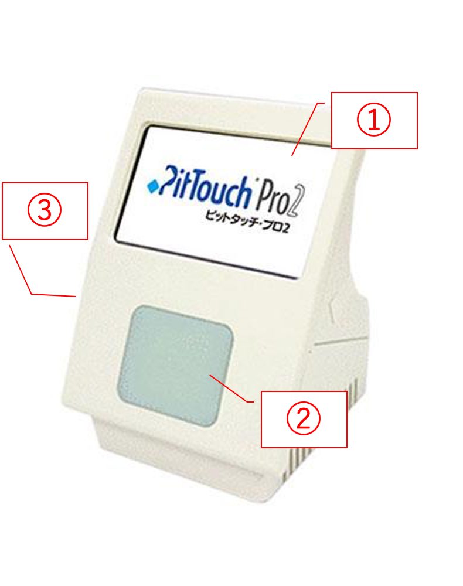
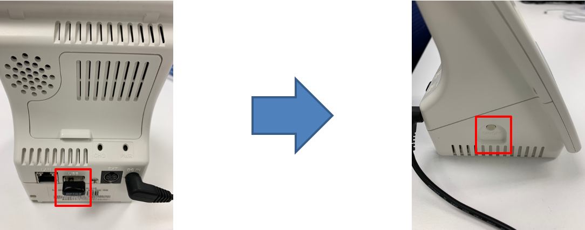
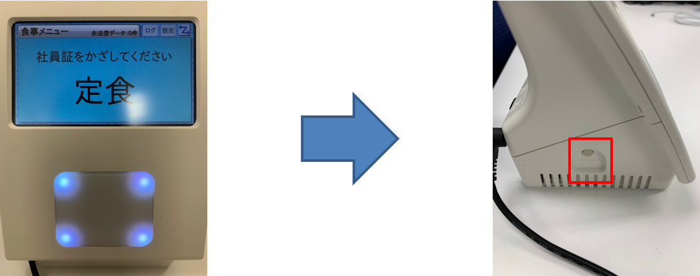
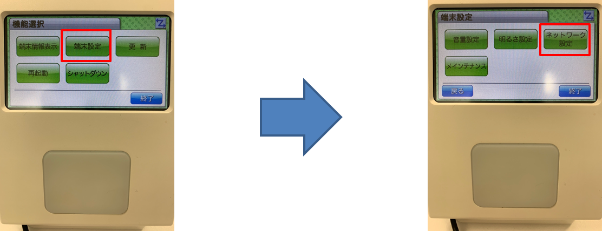
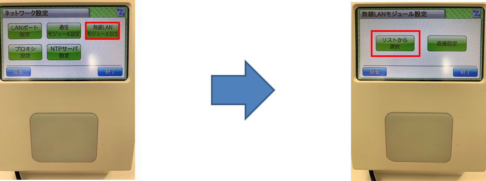
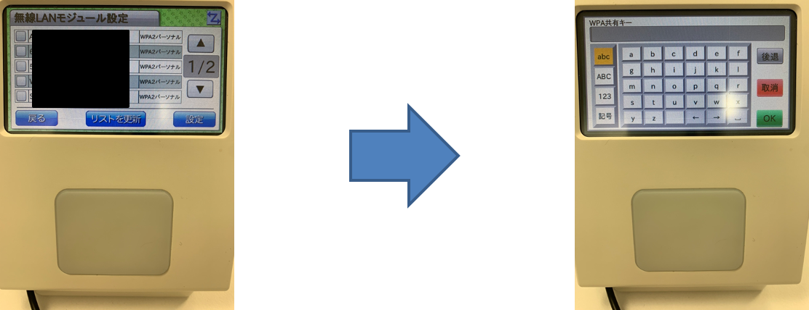
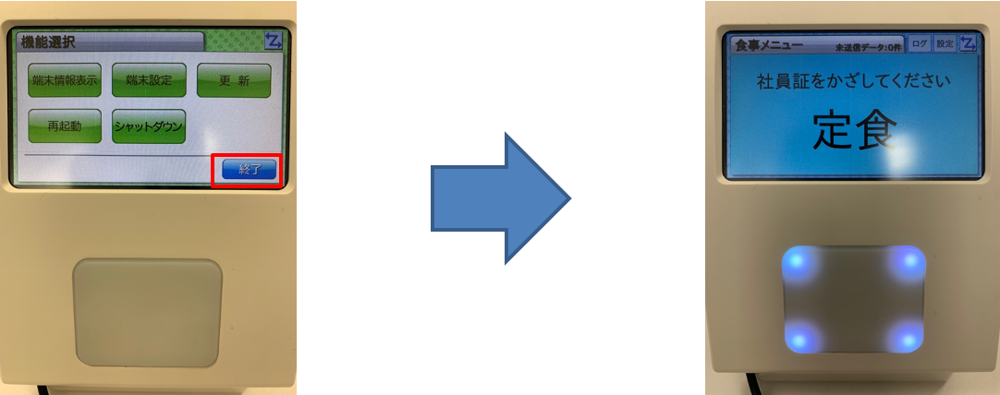

# ピットタッチプロ２の設定方法

!!! note "その他の機器の使用方法について"
    その他の使用方法については機器同梱の取扱説明書またはメーカーサイトをご確認ください。

## 本体説明

|No|説明|
|---|---|
|1|タッチパネルです。各メニューの操作などに利用します。|
|2|ICカード読取り部です。点滅時にICカードをタッチ出来ます。|
|3|正面左側部に電源ボタンがあります。 電源OFF時に長押しすると電源ONになります。 電源ON時に長押しすると設定画面を開きます。|

## 端末起動方法

端末の起動方法は以下の手順で行います。

1. 無線LANを利用する場合はUSBに無線LANアダプタを、有線LANを使用する場合はLANケーブルをLANケーブル挿入口に挿し、、端末に電源を繋いで側部にある電源ボタンを長押しします。

## 無線LAN設定方法

1. 画面が表示されましたら再度側部の電源ボタンを長押しして設定画面を表示させます。

2. 「端末設定」ボタンを押したのち、「ネットワーク設定」ボタンを押します。  
パスワード入力画面が表示されるので「0000」を入力してOKを押します。

3. 「無線LANモジュール設定」ボタン →「リストから選択」ボタンを押します。

4. お使いのアクセスポイントを選択し、キーを入力し、OKを押してください。  
※無線LANは接続するまでに1分程度かかります。右上の接続マークが正常に戻るまでしばらくお待ちください。

5. 「終了」ボタンを押すとタッチ待機画面へ戻ります。  
※無線LANは接続するまでに1分程度かかります。右上の接続マークが正常に戻るまでしばらくお待ちください。

## 自動再起動について

毎日23:40に自動で端末の再起動が行われます。
その際に新しいコンテンツが配布されていた場合は自動でコンテンツをアップデートします。

!!! warning "ご利用上の注意点"
    再起動の際に、ピットタッチプロ本体の電源がOFFの状態だと情報が更新されないため、出来るだけ端末の電源はONにしてください。