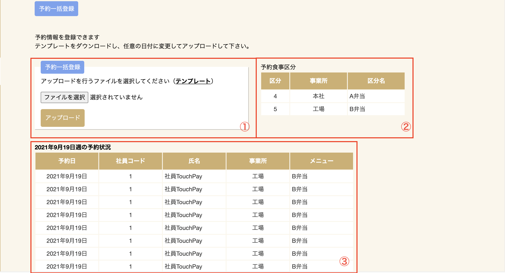

# 予約一括登録
指定のフォーマットでExcelを作成し、アップロードすることで予約を一括で登録することができます。

| No. | 説明                                                                                                                                                                                   |
| --- | -------------------------------------------------------------------------------------------------------------------------------------------------------------------------------------- |
| 1   | 予約一括登録用ファイルをアップロードするための機能です。                                                                                                                               |
| 2   | 予約が可能な食事の食事区分を表示します。                                                                                                                                               |
| 3   | 現在の予約状況の一覧を表示します。 画面を表示した日付によって下部に表示される予約状況に表示される週が変わります。（画面表示日が日曜〜水曜なら翌週分、木曜〜土曜なら翌々週分が表示） |

## テンプレートダウンロード
画面上のテンプレートをクリックするとテンプレートExcelファイルがダウンロードできます。

### テンプレート内容

※1行に対し、1社員、1メニューの予約となります。

| No. | 説明                                                                                                                                                                    |
| --- | ----------------------------------------------------------------------------------------------------------------------------------------------------------------------- |
| 1   | 予約を登録する社員の社員番号を入力します。                                                                                                                              |
| 2   | 社員名を入力します。登録には影響しないため、ファイル作成時のメモとしてご利用ください。未入力も可能です。                                                                |
| 3   | 予約するメニューの食事区分を入力します。食事区分は一括登録画面の予約が可能な食事区分の一覧から選択ください。                                                            |
| 4   | 予約する日時と個数を入力します。1行目には予約する日時、2行目以降は予約個数を入力ください。 数字または未入力のみ有効で、0または未入力の場合予約の登録は行われません。 |

## ファイルアップロード

1. ダウンロードしたExcelを[テンプレート内容](#_3)に沿って編集します。
2. 「ファイルを選択」ボタンをクリックし、作成したファイルを選択します。
3. 「アップロードボタン」をクリックすると、Excelに入力した予約が登録されます。 
