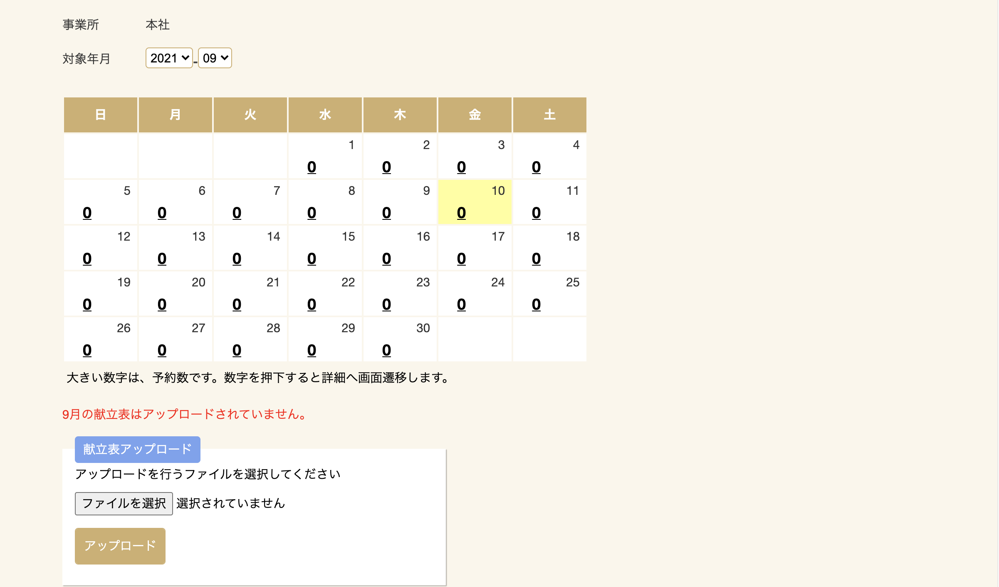
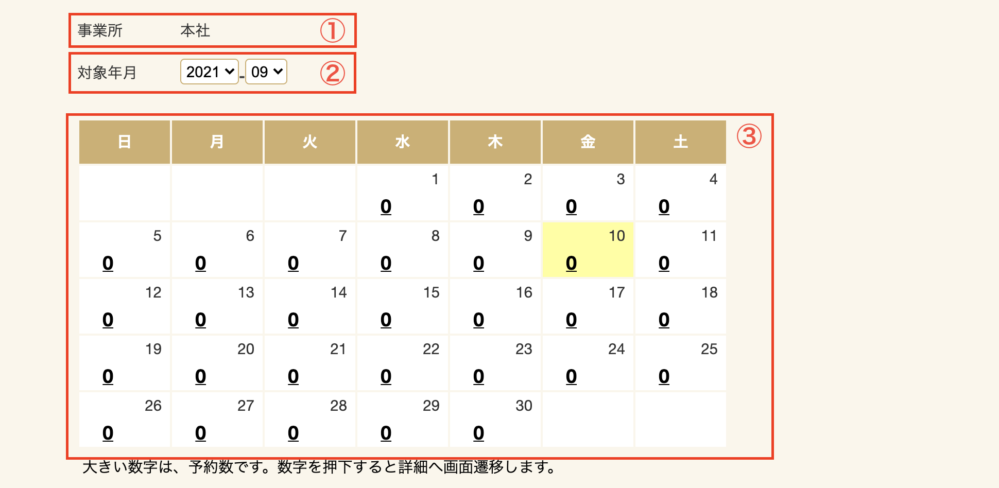
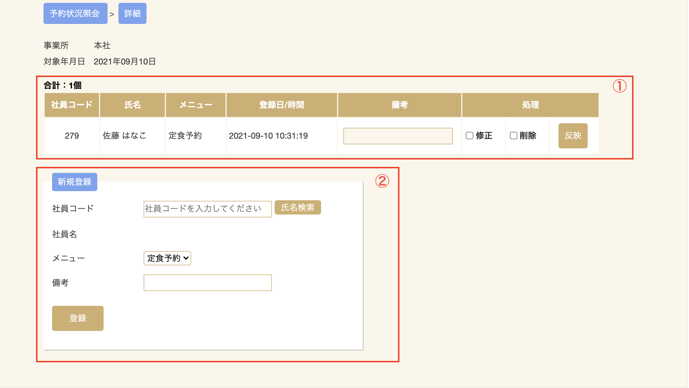
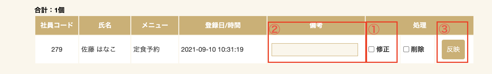
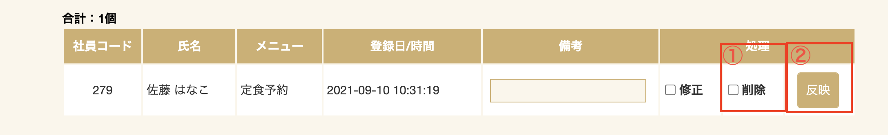
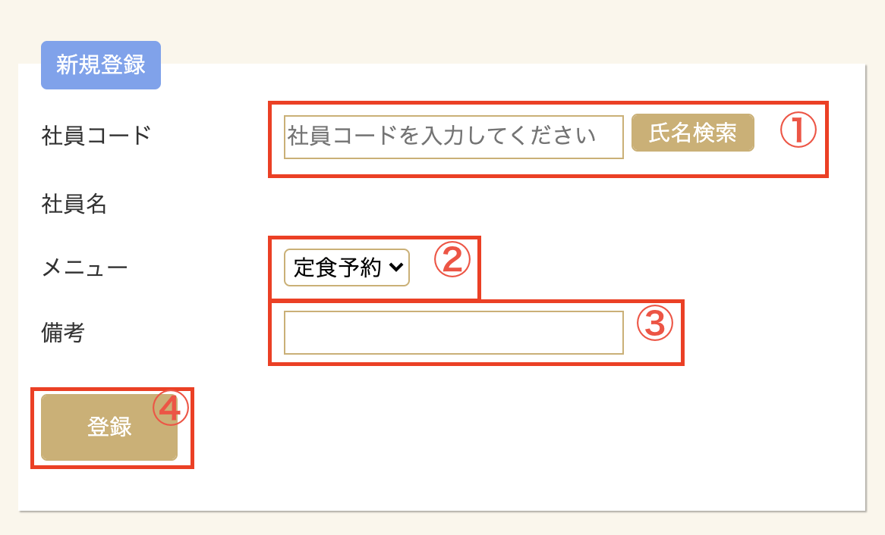
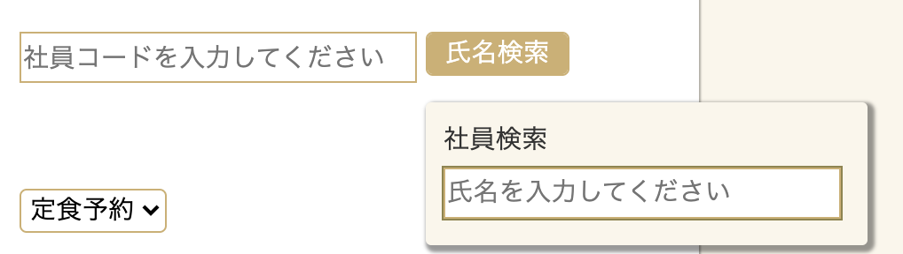
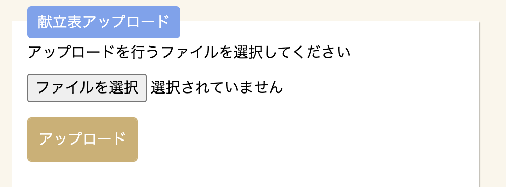

# 予約状況照会

## 予約カレンダー画面
事業所毎に日別の予約総数が確認できます。日別の予約総数のリンクをクリックすると、予約した社員、メニュー情報が分かります。

| No. | 説明                                                                                                 |
| --- | ---------------------------------------------------------------------------------------------------- |
| 1   | ｢対象年月｣を選択します。                                                                             |
| 2   | 太字で表示されている予約数をクリックしていただくと、予約詳細画面に遷移し、予約数の内訳が見られます。 |
| 3   | 黄色で表示されている日は当日を示します。                                                             |

## 予約詳細画面
予約数をクリックすると、予約詳細画面に遷移します。
選択した日の予約の一覧と
また、管理者が代理で新規登録できます。

| No. | 説明                                                         |
| --- | ------------------------------------------------------------ |
| 1   | 予約リストです。表示年月日に予約情報の一覧を表示します。     |
| 2   | 予約新規登録欄です。管理者から新規登録する場合に利用します。 |

### 予約備考登録
予約に対し備考を追加出来ます。

1. 「修正」チェックを入れると「備考」欄と「反映」ボタンが有効になります。
2. 備考欄に任意の文字を入力します。
3. 「反映」ボタンをクリックすると備考が反映されます。

### 予約削除
予約の削除が出来ます。

1. 「削除」チェックを入れると「反映」ボタンが有効になります。
2. 「反映」ボタンをクリックすると削除が反映されます。

### 予約新規登録
予約の新規登録が出来ます。

1. 社員コードを入力します。
    - 社員コードは検索ボタンより検索が可能です。

2. メニューを選択します。
3. 備考は、メモとして入力することができます。
4. 登録ボタンをクリックすると、表に表示されます。

## 献立表アップロード機能
個人予約画面に表示する献立表をアップロード出来ます。

1. PDF形式のファイルを選択し、アップロードボタンをクリックします。
2. 画面上部に「ファイルのアップロードに成功しました。」と表示されればアップロード成功です。
