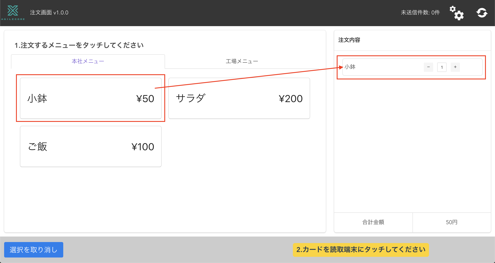
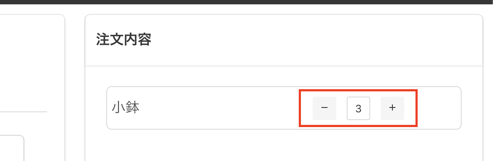
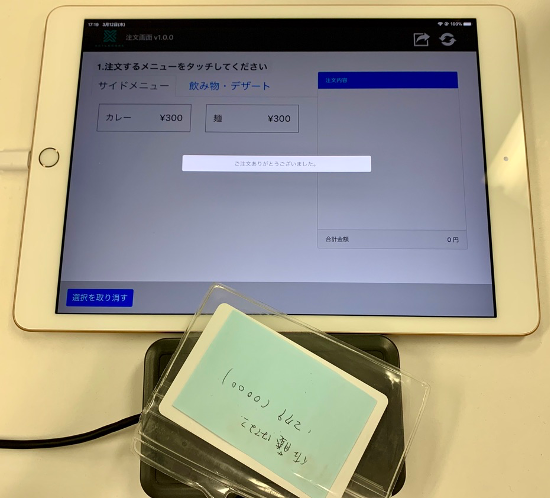
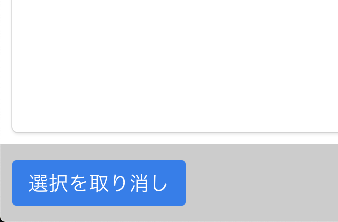
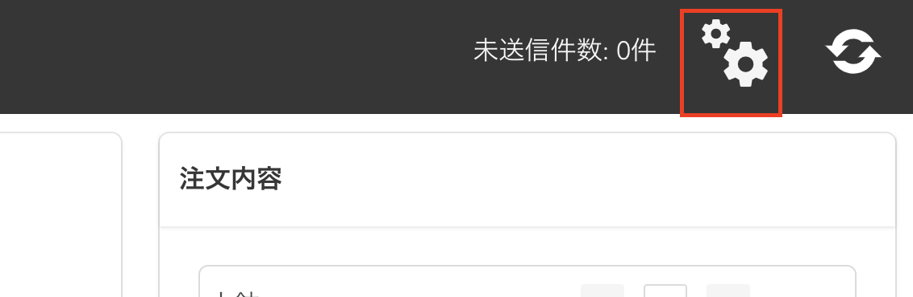
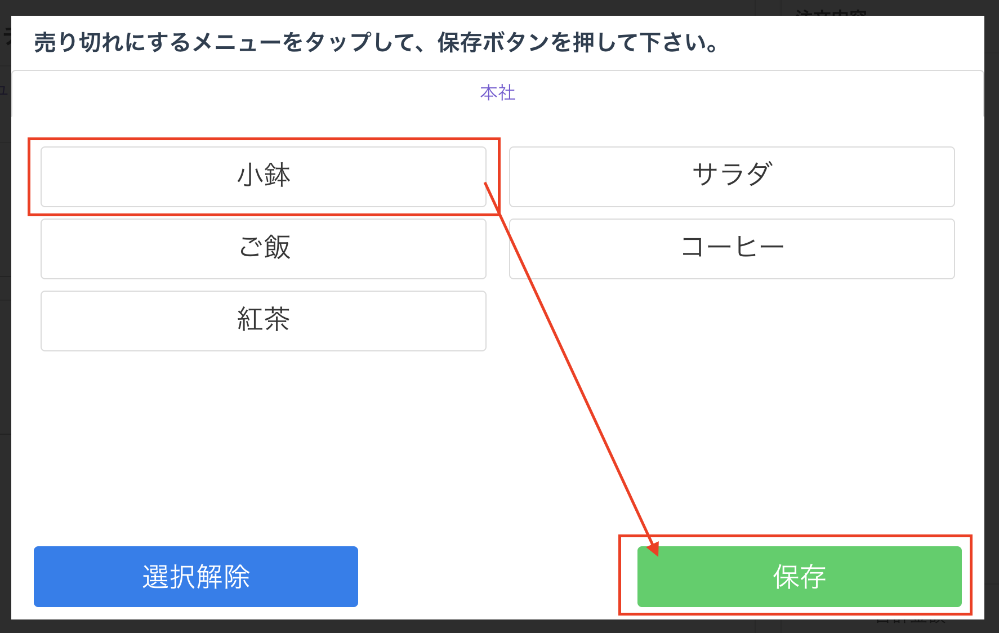
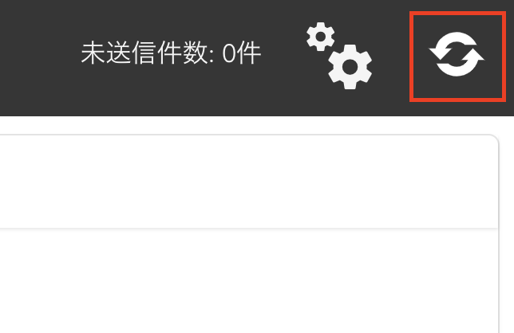

# タブレット機能 使用方法

## 注文方法

- メニューをタップすることで注文カードが表示されます  
※メニューは複数を同時に注文できます

- 注文内容の「+」「-」ボタンをタップする事で数量の増減が行えます。

- メニューが選択された状態でカードリーダに正常なカードをタッチすると、注文のデータが送信されます。

- 注文内容を取り消したい場合は左下の「選択を取り消し」ボタンをタップしてください。

## 売り切れ設定

売り切れメニューを設定できます。

- 右上の売り切れ設定ボタンをタップします。

- 売り切れにするメニューをタップして「保存」ボタンを押すと売り切れ設定となります。  
また、売り切れのメニューに対してもう一度タップして保存をすると売り切れ設定が解除されます。

- 全ての売り切れを解除する場合は「選択解除」ボタンを押して、「保存」ボタンを押してください

## メニュー内容更新

- メニュー内容を変更したのちにタブレットに反映するには、右上の更新ボタンをタップします。

