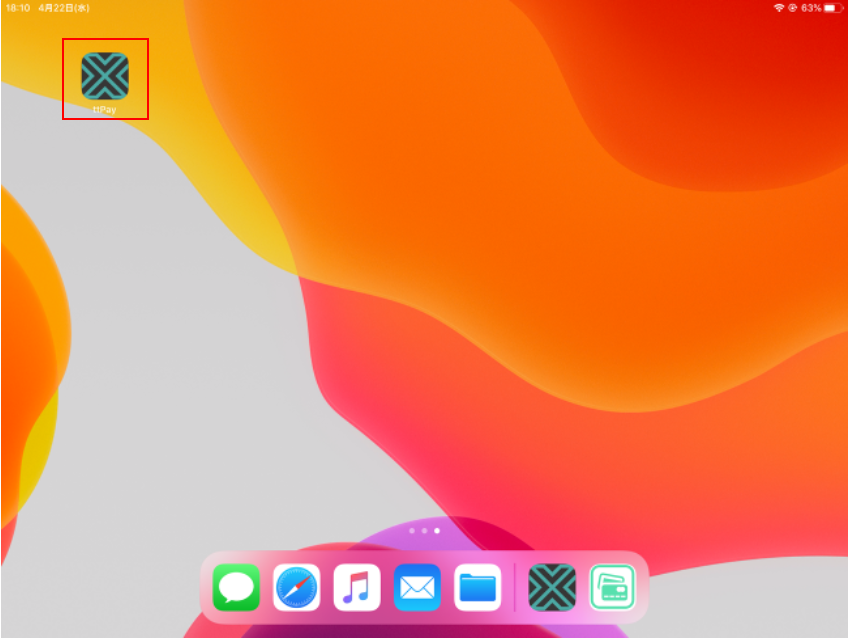
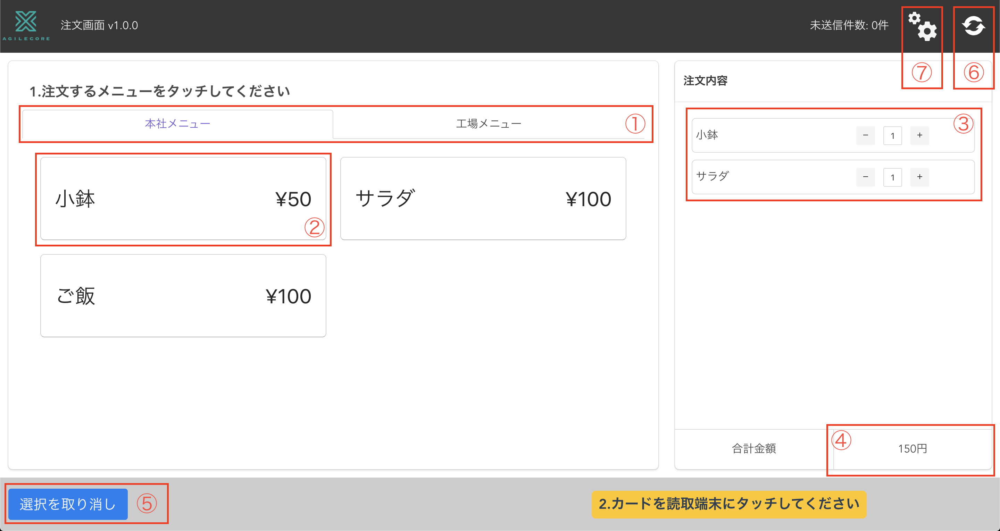

# タブレット機能 起動手順

タブレットを使用し、複数の注文を同時に行うことができます。
事前に定められた複数のメニューを選択できます。

## 起動方法

1. タブレットにカードリーダーを接続します。
2. タブレットを起動し、ホーム画面のアイコンをタップします。

## 画面説明

|No|項目|説明|
|---|---|---|
|1|タブ|メニューを分類するタブです。選択されているタブの文字は紫色で表示されます。 選択されていないタブをタップする事で隠れているメニューが表示されます。|
|2|メニュー|納品時に決められたメニューが表示されています。 価格のみ食事メンテナンス機能で適用されている内容が表示されます。|
|3|注文状況|現在の注文状況が確認できます。 数字横の「-」,「+」ボタンをタップすることで注文数を変更することができます。|
|4|合計金額|現在の合計金額が確認できます。|
|5|選択を取り消し|現在の注文内容を取り消すことができます。|
|6|メニュー更新|メニュー内容を更新できます。 食事メンテナンスなどで価格を変更した場合はタップしてメニューの表示を更新してください。|
|6|売り切れ設定|売り切れ設定画面を開きます。|
