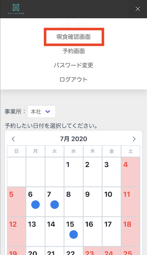
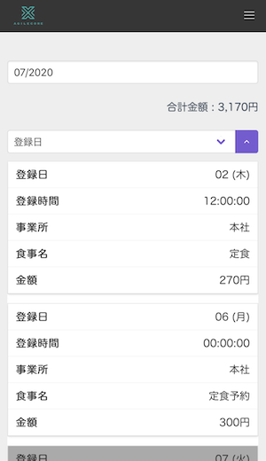
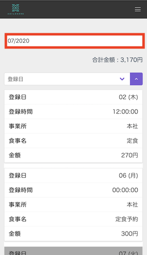
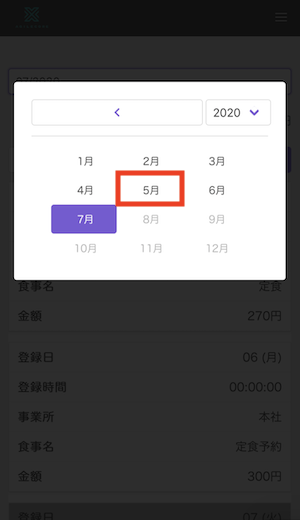
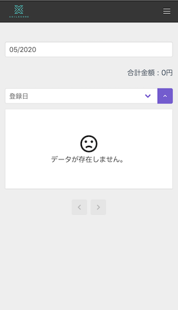
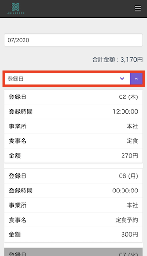
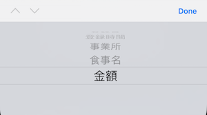
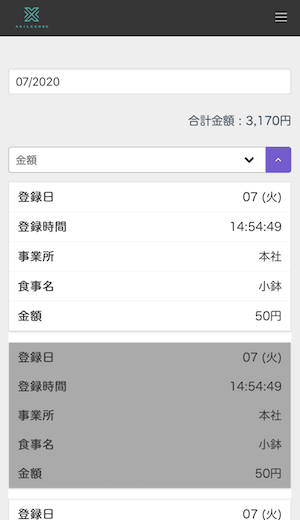
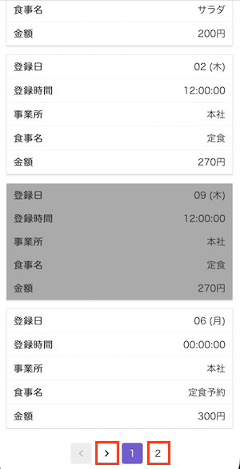
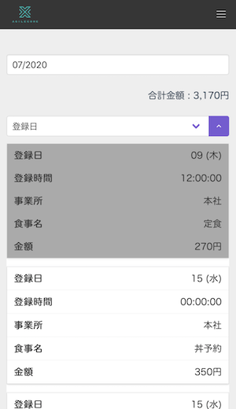

# 個人喫食確認画面　使用方法

画像は全てスマートフォンで表示した場合の画像となります。 
基本的な操作は同じです。 
PC画面の項目説明は[「起動手順・画面説明」](./user_setting.md)をご確認ください。

## 表示方法
※ 当手順は個人向け予約オプションも利用している場合の手順です。

- ナビゲーションから喫食確認画面を選択します。

　

## 使用方法

### 年月を変更

- 年月選択をタップし、表示したい月を選択します。

　

- データが存在しない場合以下の画面が表示されます。

### ソート

- スマートフォンの場合 ソート選択をタップするとソートする列名を選択できます。 紫の部分をタップするたびに昇順・降順を切り替えます。

　

> 金額で昇順にソートした場合の画像

### ページの切り替え

- ページを切り替えるにはページ番号か矢印をタップします。

> ２ページ目の画像

