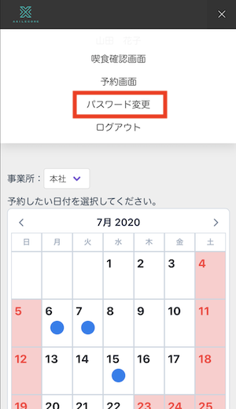
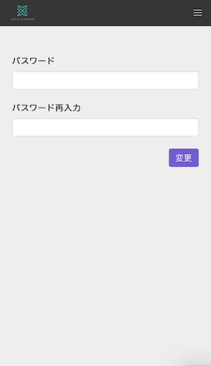
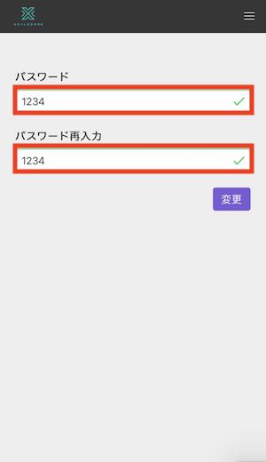
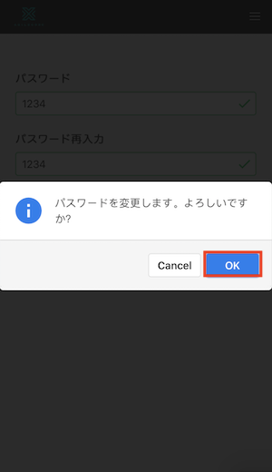
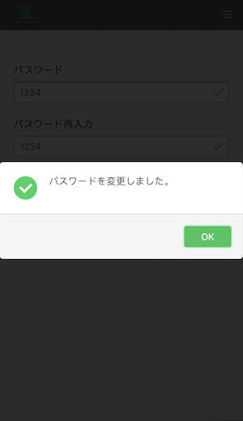

# 個人向け画面 パスワード変更

画像は全てスマートフォンで表示した場合の画像となります。 
基本的な操作は同じです。 
PC画面の項目説明は[「起動手順・画面説明」](./user_setting.md)をご確認ください。

- ナビゲーションからパスワード変更を選択します。

　

- パスワード・パスワード再入力に新しいパスワードを入力します。

- 変更ボタンをタップし、確認ダイアログでOKをタップすると新しいパスワードが保存されます。

　
