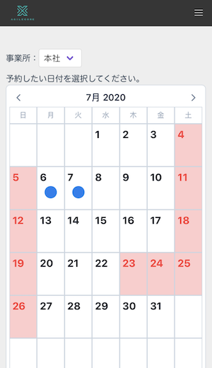
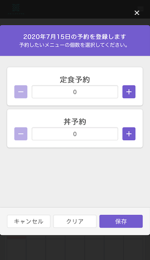
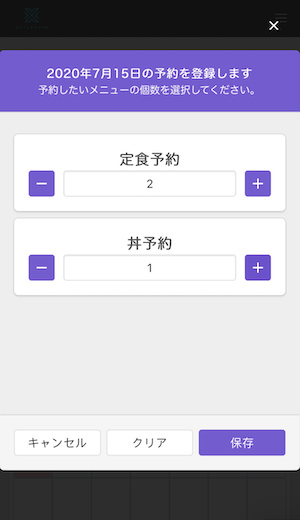
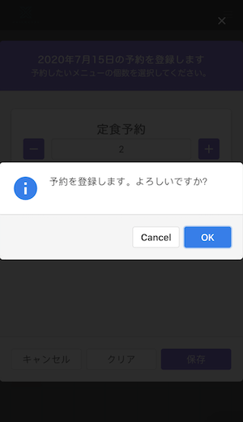
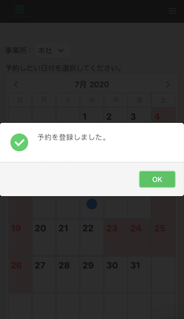
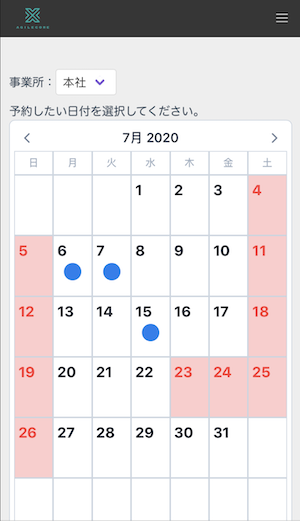

# 個人予約画面　使用方法

画像は全てスマートフォンで表示した場合の画像となります。 
基本的な操作は同じです。 
PC画面の項目説明は[「起動手順・画面説明」](./user_setting.md)をご確認ください。

## 予約確認・登録・削除手順

- カレンダーに予約の状況が表示されています。

- 予約の確認・登録・削除をしたい日付をタップすると予約登録画面が表示されます。

- 予約したいメニューの「＋」ボタンをタップします。

- 保存ボタンをタップし確認ダイアログでOKをタップすると、予約状況がサーバーに登録されます。

　

- カレンダーに戻るので、登録した日付にマークが付いていることを確認してください。

