# 個人予約画面　起動手順

## 起動方法

PCまたはスマートフォンのブラウザで個人予約画面のURLを開くと、ログイン画面が表示されます。 URLは管理者にお問い合わせください。

## 画面説明

### ログイン画面

- PC画面

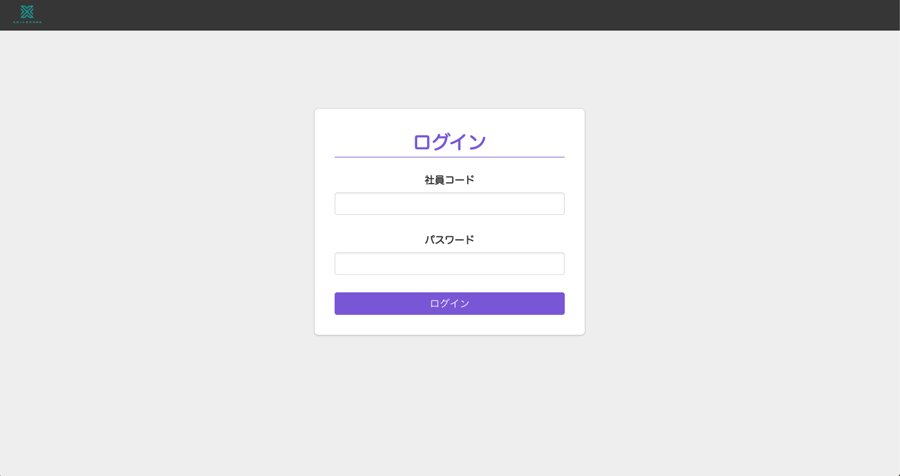

- スマートフォン画面

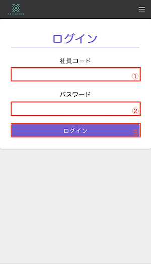

- 項目説明

|No|項目|説明|
|---|---|---|
|1|社員コード|事前に決められた社員コードを入力してください。(必須入力・半角英数字のみ)|
|2|パスワード|パスワードを入力してください。初期値「0000」(必須入力・半角英数字のみ)|
|3|ログインボタン|社員コードとパスワードを入力してからクリック/タップするとログイン処理が実行されます。 ※ 個人向け喫食確認画面のみの場合、個人喫食画面が表示されます。|

### 個人予約画面

- PC画面

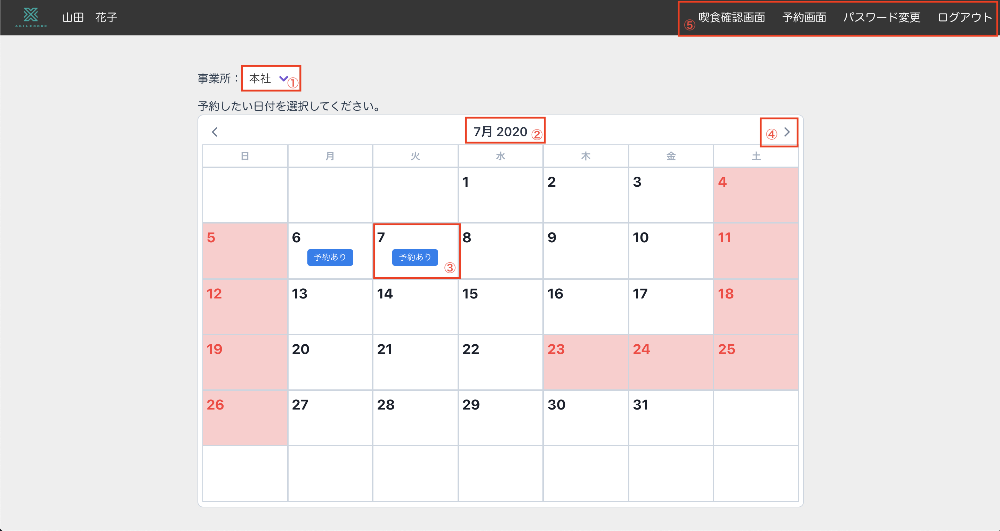

- スマートフォン画面

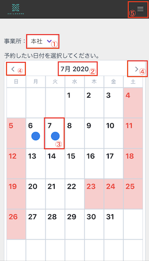
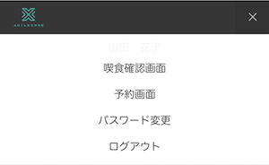

- 項目説明

|No|項目|説明|
|---|---|---|
|1|事業所選択|予約をしたい事業所を選択してください。|
|2|年月表示|現在カレンダーに表示されている年月が表示されています。 クリック/タップすることで年月を変更できます。|
|3|カレンダーのマス|その日に予約が登録されているかが確認できます。 また、クリック/タップすることで予約登録画面を表示します。|
|4|前月・翌月ボタン|クリック/タップすることでカレンダーの表示を前月・翌月に切り替えることができます。|
|5|ナビゲーション|画面を予約画面・パスワード変更画面切り替えたり、ログアウトしたりすることができます。 スマホの場合、クリック/タップすることでナビゲーションが表示されます。|

### 予約登録画面

- PC画面

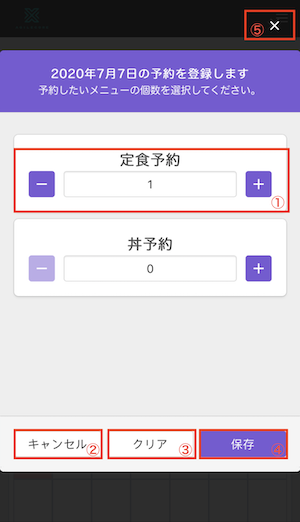

- スマートフォン画面

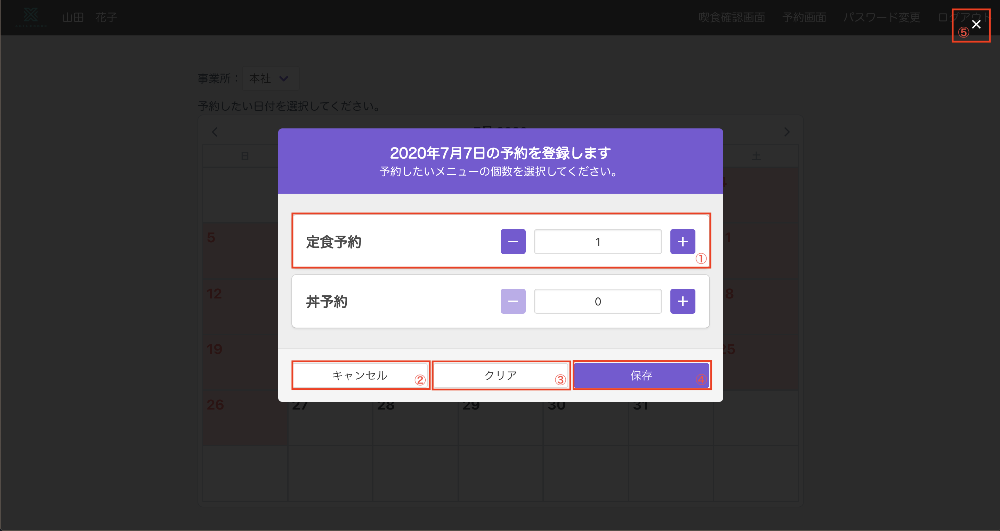

- 項目説明

|No|項目|説明|
|---|---|---|
|1|予約状況|メニュー毎の予約件数を選択できます。 「-」「+」ボタンをクリック/タップすることで数を増減することができます。 既に予約がある場合表示した時点で予約数が表示されています。|
|2|キャンセルボタン|予約の登録を行わずに当画面を閉じます。|
|3|クリアボタン|クリック/タップすると全てのメニューの表示が0になります。（登録はまだされません）|
|4|保存ボタン|各メニューの件数分その日の予約を送信します。 0にした場合そのメニューの予約は破棄されます。|
|5|✖︎ボタン|キャンセル同様、画面と閉じることができます。 その他画面の暗くなっている部分をクリック/タップしても閉じることができます。|

### 個人喫食確認画面

- PC画面

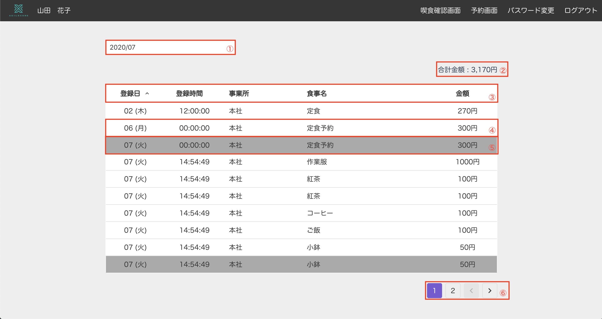

- スマートフォン画面

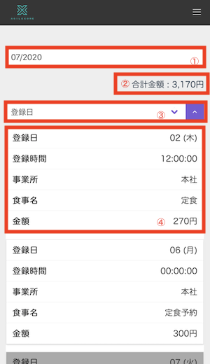
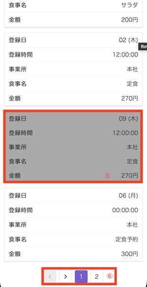

- 項目説明

|No|項目|説明|
|---|---|---|
|1|年月選択|過去3年分の月を選択することができます。|
|2|合計金額|削除されていないデータの合計金額が表示されます。|
|3|ソート列|クリック/タップすることで登録日（と登録時間）・事業所・食事名・金額でソートすることができます。 PCで表示している場合はソートしたい列名をクリックしてください。 スマートフォンの場合はタップするとどの列でソートするか選ぶことができます。|
|4|喫食データ（通常）|喫食・予約データが表示されます。|
|5|喫食データ（削除）|削除された喫食・予約データは暗く表示されます。 このデータは合計金額には反映されません。|
|6|ページ遷移|クリック/タップすると前の/次の10件のデータを表示します。|

### パスワード変更画面

- PC画面

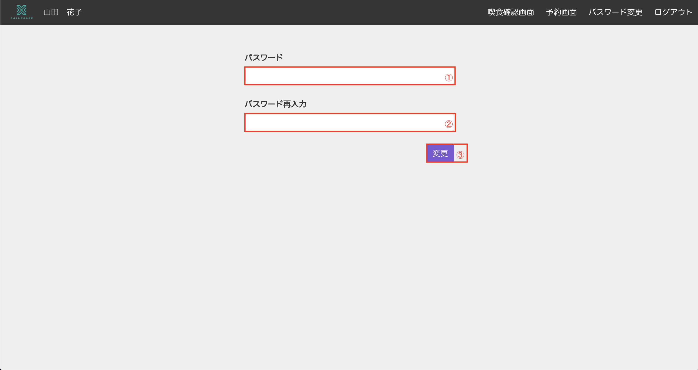

- スマートフォン画面

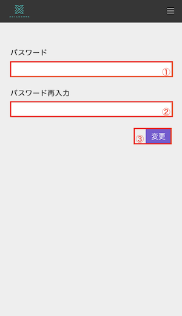

- 項目説明

|No|項目|説明|
|---|---|---|
|1|パスワード|新しいパスワードを入力してください。（半角英数字のみ）|
|2|パスワード再入力|1と同じものを入力してください。|
|3|変更ボタン|クリック/タップするとパスワードが変更されます。(パスワードは必ずご自身で覚えておいてください。)|
